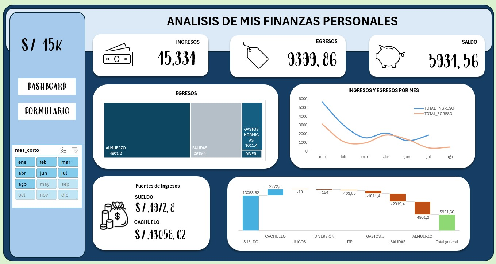
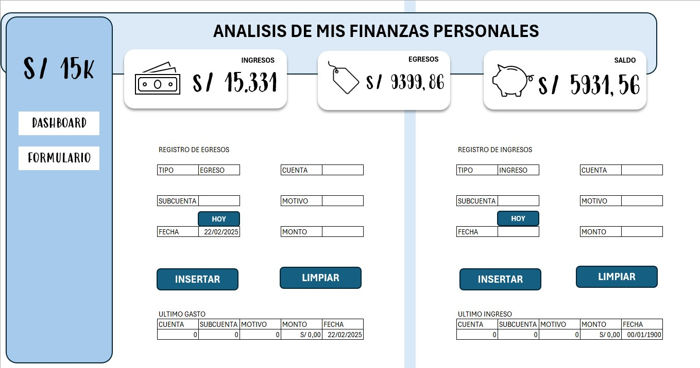

<h1 align="center">Finanzas Personales</h1>

  Este es un proyecto personal el cual fue elaborado con la finalidad de realizar un control de mis finanzas, 
  este proyecto fue elaborado en excel, utilizando herramientas comotablas dinamicas para los gráficos,
  macros para un formulario y power pivot para realizar formulas con DAX. 
  Primero cree una base de datos con columnas como el tipo, la cuenta por la que ingresa el dinero, la subcuenta como el tipo de 
  ingreso o egreso, el motivo, el monto y la fecha.
  Para poder realizar el formulario con datos correctos, se necesita validar los datos en listas, por ello, dividí las columnas 
  con sus diferentes atributos en tablas individuales, asignando un nombre a la tabla y al contenido.
  En Power Pivot, primero agregué una tabla de fechas, agregando una nueva columna llamada "mes_corto", extrayendo las primeras
  3 letras del mes y ordenandola por numero del mes. Luego relacioné ambas tablas por fecha.
  Tambien agregué medidas como el total de ingreso, egreso, el saldo restante y el porcentaje. Asi como el monto moderado para mostrar 
  de forma negativa los egresos.
  
  Para los dashboard, primero cree uno donde pueda tener los graficos y analizar mis finanzas con datos como mis ingresos, egresos, 
  el saldo restante, adjuntando graficos como los ingresos y egresos por mes, cual es el mayor motivo de mis gastos, el monto de mis
  ingresos, y un grafico con los ingresos y egresos por motivos y el saldo.

  
  

  Para el formulario cree uno para el registro y otro para el egreso, ambos cuentan con los campos de la base de datos, incluyendo 
  un boton "hoy" que marca la fecha de hoy y  cada campo tiene datos validados, para ello se dividio cada campo de la tabla. Al darle al 
  boton "insertar", automaticamente, se ingresara los datos seleccionados en la base de datos, y si utilizamos el boton "limpiar", 
  los datos se borraran a excepcion del tipo.
  

  

  

